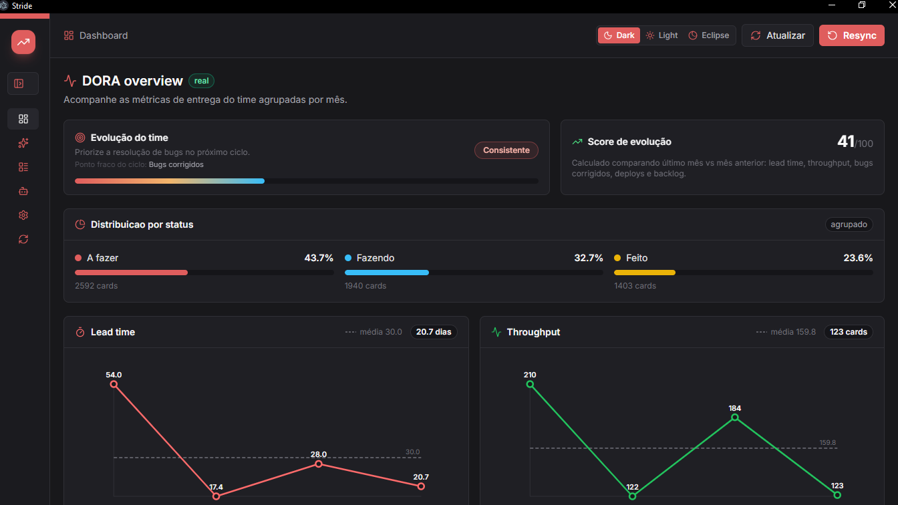

# Stride DORA

Desktop dashboard that connects to Jira and GitHub and turns your team's raw data into DORA metrics — lead time, throughput, bug trends, pull requests, and deploys — grouped by month, stored locally.



---

## Features

- **DORA overview** — monthly charts for lead time, throughput, fixed bugs, backlog, PRs, and deployment frequency
- **Delivery flow** — work grouped into To Do, Doing, and Done to surface bottlenecks and WIP pressure
- **Activities** — full list of Jira cards and GitHub pull requests with search, filters, and detail modal
- **Team evolution** — score based on real trend comparison across the last two months
- **AI insights** — ask questions about team performance in plain language via OpenRouter
- **Runs locally** — all data stored in a local SQLite file; no cloud account needed

---

## Install

### Option 1 — Installer (recommended)

Download the latest release from the [Releases page](https://github.com/otechmista/stride/releases):

| Platform | File |
|---|---|
| Windows | `Stride-DORA-Setup-x.x.x.exe` |
| Linux | `Stride-DORA-x.x.x.AppImage` |

**Windows:** double-click the `.exe` and follow the installer. A shortcut is created on the Desktop and Start Menu.

**Linux:** make the AppImage executable and run it:
```sh
chmod +x Stride-DORA-*.AppImage
./Stride-DORA-*.AppImage
```

---

### Option 2 — Run from source

Requires [Bun](https://bun.sh).

**Windows:**
```powershell
powershell -ExecutionPolicy Bypass -File .\scripts\install.ps1
```

**Linux / macOS:**
```sh
chmod +x ./scripts/install.sh ./scripts/start-stride.sh
./scripts/install.sh
```

Both scripts install dependencies, generate icons, set up Electron, and create a desktop shortcut.

To start manually after installing:
```sh
bun run dev:desktop
```

---

## Configure

Open the **Conexões** tab after launching the app:

**Jira**
- URL: `https://your-company.atlassian.net`
- E-mail and API token ([create one here](https://id.atlassian.com/manage-profile/security/api-tokens))
- Leave the project field empty to import all accessible active projects

**GitHub**
- Personal access token with `repo` scope
- Owner: your GitHub username or organization

**AI — optional**
- OpenRouter API key ([openrouter.ai](https://openrouter.ai))
- Enables the AI Insights tab for plain-language questions about your data

> Credentials are stored locally in this installation and never sent anywhere except the respective APIs.

---

## Usage

1. Open **Conexões** → add credentials → Save
2. Click **Atualizar** in the top bar to import data (or **Resync** to start fresh)
3. Explore the **Dashboard** for DORA charts and team evolution score
4. Open **Atividades** to browse Jira cards and PRs with full descriptions and assignees
5. Use **IA Insights** to ask questions and get prioritized recommendations

---

## Development

```sh
bun install
bun run dev          # web server only — http://localhost:3000
bun run dev:desktop  # Electron window
```

Generate icons from `build/icon.svg`:
```sh
bun run build:icons
```

---

## Build installers

```sh
bun run build:icons   # generate icon.png and icon.ico from build/icon.svg
npm run dist:win      # → dist/*.exe  (Windows NSIS installer)
npm run dist:linux    # → dist/*.AppImage
```

The [GitHub Actions workflow](.github/workflows/build-desktop.yml) runs automatically when a release is published on GitHub and attaches the built files for download.

---

## Project structure

```
electron/       Electron main process
public/         Frontend — vanilla JS SPA, Tailwind CSS, Lucide icons
src/
  config.js     Credentials storage
  sync.js       Jira & GitHub data import
  data.js       Issues and PRs API
  metrics.js    DORA metrics calculations
  ai.js         AI chat via OpenRouter
scripts/        Install and build helper scripts
build/          Icon source (icon.svg) — generated files are gitignored
docs/           GitHub Pages site
data/           Local SQLite database — gitignored
```

---

## License

MIT
